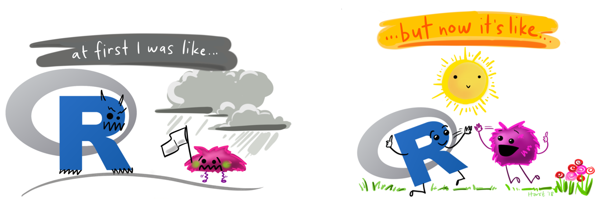
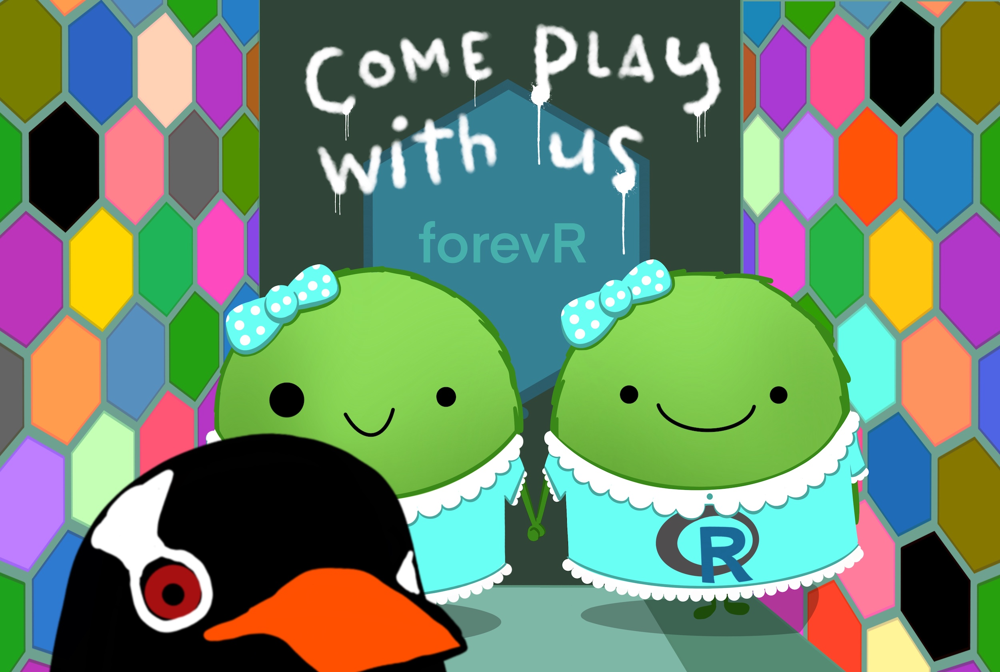

```{r, include = F}
# This is the recommended set up for flipbooks
knitr::opts_chunk$set(message = FALSE, warning = FALSE, comment = "", cache = F)
library(flipbookr)
library(tidyverse)
library(lubridate)
library(bupaR)
```
# Outline 
- ### 1a) What is time motion study? 
- ### 1b) What data is needed for time motion study? 
- ### 2a) Why I should do it in `R`? 
- ### 2b) How I can I do it in `R`? 
---

class: inverse, middle, center
# What is time motion study? 

---

# Example of "motion" element 
### Activities involved in hospital admissions (artificial data)
```{r echo=F}
activity_labels(patients)
```
### There can be different permutations and combinations activities for a work process
---

## Why time motion study? 
- ### Uncover the sequencing of activities in workflow 
- ### Identify bottlenecks
- ### Identify outliers when compared against a theoretical workflow model
- ### Examine the relationship between resource providers
---

## [What did my department use it for?](https://github.com/notast/Time-Motion-Study/blob/main/Conference%20Presentation_Time-motion%20analysis%20for%20productivity.pdf)
- ### Examine factors affecting productivity
- ### 1. Proportion of inappropriate referrals
- ### 2. Total duration for case management (direct and indirect patient activities)  
---

# Outline 
- ### ~~1a) What is time motion study?~~
- ### 1b) What data is needed for time motion study? 
- ### 2a) Why I should do it in `R`? 
- ### 2b) How I can I do it in `R`? 
---

`r chunk_reveal("eventlog", display_type = "output", title = "# What to collect")`

```{r eventlog,  include=F}
patients_df<-tibble(patients)

patients_df %>% select(time,registration_type, .order) %>% 
  left_join(patients_df %>% select(patient, .order), by=".order") %>% 
  left_join(patients_df %>% select(employee, .order), by=".order")
```
---

### When data is more than _time_ and _motion_, the analysis becomes more of process mining/process analysis
```{r echo=F}
mapping(patients)
```
--
### For simplicity, we'll call it time motion study  
---

# Where to collect data for time motion study?
- ### Observational Study 
- ### Self reporting 
- ### Logs from IT system
---

# Outline 
- ### ~~1a) What is time motion study?~~
- ### ~~1b) What data is needed for time motion study?~~
- ### 2a) Why I should do it in `R`? 
- ### 2b) How I can I do it in `R`? 
---

`r chunk_reveal("why_R_1", widths=c(40, 60), title = "### 1. Add comments as you formulate your analysis")`

```{r why_R_1, include=F}
# Boss wants 3 columns from the times tamp 
# 1 Day of week
# 2 Month 
# 3 Year

patients_df %>% tail(1) %>% select(time) %>% 
  mutate(
# 1 Day of week
    DOW= wday(time, abbr = T),  
# 2 Month 
    Month= month(time, abbr = T), 
# 3 Year
    Year= year(time), 
# keep none of the original columns 
    .keep="none")
```
---

`r chunk_reveal("why_R_2", title = "### 2. Analysis doesn't change if you relocate your columns")`

```{r why_R_2, include=F}
patients_df %>% tail(1) %>%
  relocate(time, 1) %>% 
    mutate(DOW= wday(time, abbr = T),
           Month= month(time, abbr = T), 
           Year= year(time),
           .keep="none") 
```
---

`r chunk_reveal("why_R_3", break_type = "rotate", chunk_options = "fig.width = 13", display_type = "output", title = "### 3. Stun your boss's with amazing visualizations")`

```{r why_R_3, include=F}
patients_df<-patients_df %>% mutate(handling= fct_relevel(handling, "Registration", "Triage and Assessment", "Blood test", "X-Ray", "MRI SCAN", "Discuss Results", "Check-out"))

patients_df %>% dplyr::mutate(
  time= format(time, format = "%H:%M:%S") %>% as.POSIXct(format = "%H:%M:%S"), #standardized the date for ploting
  hour= lubridate::floor_date(time, "hour")) %>% # round down time to nearest hour
count(handling, hour)%>% # total instances of each activity at each hour
add_count(handling, wt=n) %>% # total instances of each activity 
mutate(percent= ((n/nn)*100)) %>% #relative freq for each activity
  ggplot(aes(hour, handling, fill=percent)) + geom_tile(size=.5, color="white") +
  theme_classic() +
  labs(x="24hour Clock", y="", title= "Peak and Lull Period of Patient Activities", subtitle= "percentage calculated is the relative frequency for a specific activity", fill="%")  + scale_y_discrete(limits = rev(levels(patients_df$handling)))+ # reverse display of y-axis varaibles 
scale_x_datetime(date_breaks = ("1 hour"), date_labels = "%H") + #display only 24H clock values 
  scale_fill_viridis_c(option = "magma", alpha=.8) + #ROTATE
  scale_fill_viridis_c(option = "cividis", alpha=.8) + #ROTATE
  scale_fill_viridis_c(option = "plasma", alpha=.8) #ROTATE
```
---

## 4a. `R`’s `tidyverse` 
- ### some languages are harder to learn than others due to their rules
- ### programming/scripting languages have rules too
- ### `R` has `tidyverse` rules which is beginner friendly
- ### `tidyverse` rule 1– verb heavy 
---


##### Artwork by @allison_horst
---


##### Artwork by @allison_horst
---

## `tidyverse` rule 2– pipeline production `%>%`
```{reval=F}
Output <-Input  %>% 
               Step 1 %>% 
               Step 2 %>% 
               ... %>% 
               Last step
```

---

## 4b. `R` packages 
- ### `R` packages = mobile phone apps
- ### `R` has specific packages for time motion analysis that follow `tidyverse` style
- ### primary package [`bupaR`](http://bupar.net/). 7 secondary packages
---

```{r why_R_4_MRI, include=F}
  patients %>% 
  filter_activity_presence("MRI SCAN") %>% 
    throughput_time(level="case",  
                    units="days") %>% 
  summary()
```
`r chunk_reveal("why_R_4_MRI", widths=c(45, 55), title = "### LOS of patients with MRI scan")`
---

`r chunk_reveal("why_R_4_noMRI", widths=c(45, 55), title = "### LOS of patients without MRI scan")`

```{r why_R_4_noMRI, include=F}
patients %>% 
  filter_activity_presence("MRI SCAN", 
                           method="none") %>% 
    throughput_time(level="case",
                    units="days") %>% 
  summary()
```

---

# 5. One stop shop

##### Artwork by @allison_horst
---

##### Artwork by @allison_horst
---

# 6. As text/ code/ comments of your analysis are in one place, it is reproducible. 

##### Artwork by @allison_horst
---

# Outline 
- ### ~~1a) What is time motion study?~~ 
- ### ~~1b) What data is needed for time motion study?~~ 
- ### 2a) ~~Why I should do it in `R`?~~ 
- ### 2b) How I can I do it in `R`?
---

### Boss   _"I heard you attended HAT."_

--

### You   _"Yeah, why?"_

--

### Boss   _"There are so many patients coming in at different times and doing different activities. Quite hard to visualize their movements."_ 

--
### Boss   _"Can you use your HAT skills to create a flow map from the time patients were admitted to discharge?"_
---

### Getting you comfortable to use `bupaR` in `R`

##### Artwork by @allison_horst

---

# setup

```{r}
# the packages
library(tidyverse)
library(bupaR) # primary
library(processanimateR) # secondary package which is not automatically loaded with bupaR 
```
--

```{r eval=F}
# import data
dataset<- read_csv("file name.csv")

# convert to format recognized by bupaR
dataset_bupaR_format<-
  dataset %>% 
    eventlog(
        case_id = "patient",
        activity_id = "activity",
        activity_instance_id = "activity_instance",
        lifecycle_id = "status",
        timestamp = "timestamp",
        resource_id = "resource"
    )
```
---

```{r echo=F}
patients_df
```
---

# Create a flow map 
### Journey of 500 patients across a fixed time period
```{r out.width="90%", out.height="50%"}
patients %>%
    process_map()
```
---

# Animate it 
### The journey of the patients at specific time points 
```{r}
patients %>%   animate_process()
```
---

`r chunk_reveal("animate_duration", break_type = "replace", float = "top", replacements = c(60, 30), replace = "60", title="### It’s okay if you don’t know\n https://bupaverse.github.io/processanimateR/reference/animate_process.html", widths=99)`

```{r animate_duration, include=F}
patients %>% 
  animate_process(duration=60)
```
---

- ### Boss   _"I heard you attended HAT."_
- ### You   _"Yeah, why?"_
- ### Boss   _"There are so many patients coming in at different times and doing different activities. Quite hard to visualize their movements."_ 
- ### Boss   _"Can you use your HAT skills to create a flow map from the time patients were admitted to discharge?"_

--

- ### You   _"Here you go boss."_
---

```{r out.width="90%"}
animate_process(patients,
    #slow down, easier to spot bottleneck 
                duration=200,  
    # a colour for each pt
  mapping = token_aes(color = token_scale("patient",scale = "ordinal", range = RColorBrewer::brewer.pal(12, "Paired"))))
```
---

# Any Questions 

##### Artwork by @allison_horst
